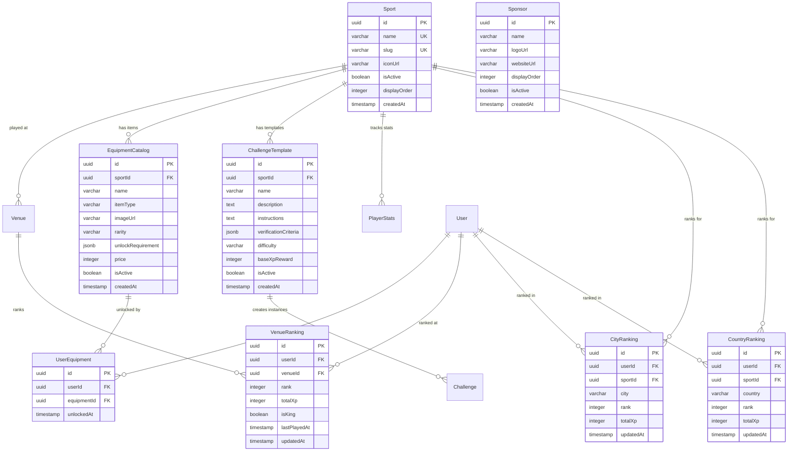

# Entity Relationship Diagram

## MVP Phase 1 - Core Database Schema

## MVP Phase 2 - Enhanced Features

## Future Enhancement - Sport as First-Class Entity

## Key Relationships Explained

### MVP Phase 1 Core Relationships:
1. **User → ChallengeSubmission** (1:N): Users can submit many challenges
2. **User → PlayerStats** (1:1): Each user has one stats record per sport
3. **User ← Venue** (1:N): User can be king of multiple venues
4. **Venue → Challenge** (1:N): Each venue has multiple challenges
5. **Challenge → ChallengeSubmission** (1:N): Each challenge receives many submissions

### MVP Phase 2 Relationships:
1. **User → Avatar** (1:1): Each user has one avatar
2. **Avatar → AvatarEquipment** (1:N): One avatar, multiple sport loadouts
3. **User ↔ Venue** (M:N via ActivePlayer): Users can play at multiple venues

### Future Enhancement Relationships:
1. **Sport → Everything**: Sport becomes the central organizing entity
2. **User → Equipment** (M:N via UserEquipment): Users unlock many items
3. **Ranking Tables**: Separate optimized tables for venue/city/country rankings
4. **ChallengeTemplate → Challenge** (1:N): Reusable challenge definitions

## Cardinality Legend:
- `||--o{` : One to Many (1:N)
- `||--o|` : One to Zero-or-One (1:0..1)
- `||--||` : One to One (1:1)
- `}o--o{` : Many to Many (M:N)

## View Online:
Copy the Mermaid code blocks into:
- GitHub (auto-renders in .md files)
- https://mermaid.live (for interactive editing)
- VS Code with Mermaid extension
