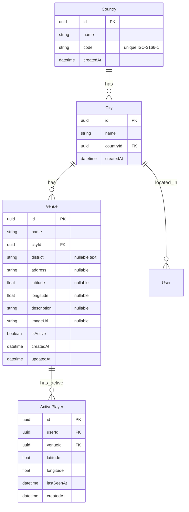
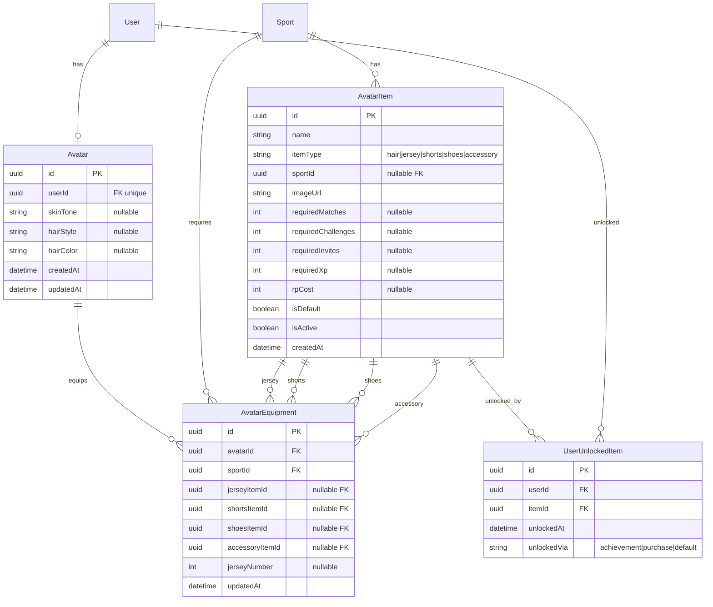
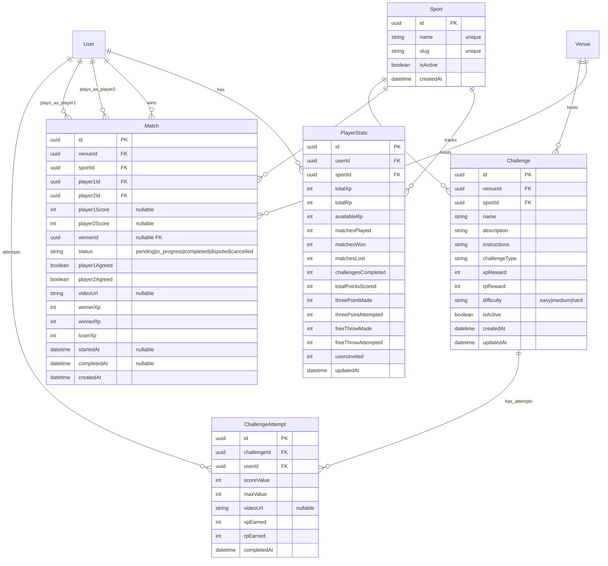
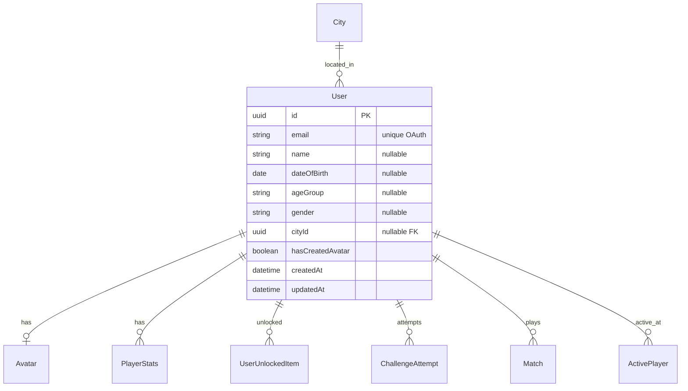
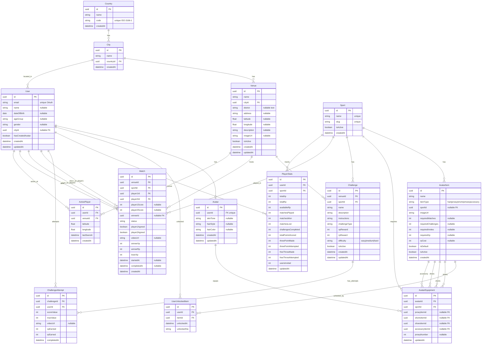

# Schema Documentation

**Last Updated:** 2025-12-19
**Status:** Active Development
**Principles:** KISS, YAGNI, TDD

> This document contains all database schema documentation including ER diagrams, field descriptions, and design decisions.

---

## Database Connection

| Property | Value                                            |
| -------- | ------------------------------------------------ |
| Provider | Azure PostgreSQL                                 |
| Host     | `www-site-db-server.postgres.database.azure.com` |
| Port     | `5432`                                           |
| Database | `beatthekings`                                   |
| User     | `beatthekings_user`                              |
| SSL      | Required (`?sslmode=require`)                    |

Password stored in `.env` (not committed).

---

## Table of Contents

1. [Location & Venue System](#1-location--venue-system)
2. [Avatar & Equipment System](#2-avatar--equipment-system)
3. [Game, Match & Stats System](#3-game-match--stats-system)
4. [User & Authentication](#4-user--authentication)
5. [Complete ER Diagram](#5-complete-er-diagram)
6. [Design Decisions](#6-design-decisions)
7. [Field Reference](#7-field-reference)

---

## 1. Location & Venue System

The location system uses a simplified 3-tier hierarchy: **Country → City → Venue**. This enables city/country rankings while keeping the structure simple (KISS/YAGNI principles).

**Design Decision:** District is stored as an optional text field on Venue (not a separate table) because:
- "District" means different things globally (Vienna Bezirk = neighborhood, Austrian Bezirk = large area, NYC boroughs, etc.)
- No district-level rankings needed
- Simpler to maintain and query

### ER Diagram



### Key Points

- **Country** uses ISO 3166-1 codes (AT, US, GB, etc.) - `code` is unique
- **City** belongs to a Country (no State/Province layer for simplicity)
- **Venue** must belong to a City; `district` is an optional text field (e.g., "6. Bezirk", "Downtown")
- **Rankings**: 3 tiers only - Venue → City → Country (no district-level rankings)
- **ActivePlayer** tracks real-time player presence at venues with GPS coordinates

---

## 2. Avatar & Equipment System

Players customize avatars with sport-specific equipment. Items are unlocked through gameplay achievements or purchased with RP (Reward Points).

### ER Diagram



### Key Points

- **Avatar** is 1:1 with User, stores base appearance (skin, hair)
- **AvatarItem** is the catalog of all available items
- **AvatarEquipment** stores equipped items per sport (one loadout per sport)
- **UserUnlockedItem** tracks which items a user has access to
- Items can be unlocked via achievements OR purchased with RP
- `isDefault` items are available to all users from the start

### Item Unlock Requirements

Items can require ANY combination of:

- `requiredMatches` - Win X matches
- `requiredChallenges` - Complete X challenges
- `requiredInvites` - Invite X users
- `requiredXp` - Reach X total XP
- `rpCost` - Purchase with Reward Points

---

## 3. Game, Match & Stats System

The core gameplay loop: challenges at venues, 1v1 matches, XP/RP progression, and detailed statistics.

### ER Diagram



### Key Points

#### Sport

- First-class entity enabling proper foreign keys
- `slug` used in URLs (e.g., `/sports/basketball`)

#### Challenge vs Match

- **Challenge**: Solo activity at a venue (free throws, penalty kicks)
- **Match**: 1v1 competition between two players

#### Match Flow

1. Player1 creates match (`status: pending`)
2. Player2 accepts (`status: in_progress`)
3. Both players agree on score (`player1Agreed`, `player2Agreed`)
4. Winner determined, XP/RP awarded (`status: completed`)
5. Disputes possible if scores don't match (`status: disputed`)

#### Dual Currency System

- **XP (Experience Points)**: Measures skill/progression, used for rankings
- **RP (Reward Points)**: Spendable currency for purchasing items
- `totalRp` = lifetime earned, `availableRp` = current balance

#### PlayerStats

- One record per user per sport
- Basketball-specific fields (3PT, FT) - extend for other sports as needed
- `usersInvited` tracks referrals for unlock requirements

---

## 4. User & Authentication

User model simplified for OAuth-based authentication (no email verification flow).

### ER Diagram



### Key Points

- **OAuth-based auth**: Email is unique identifier from OAuth provider
- **Progressive profile**: Most fields nullable, filled in during onboarding
- **Age groups**: `Under-18`, `18-30`, `31+` (calculated from dateOfBirth)
- **hasCreatedAvatar**: Gates access to gameplay features
- No password field - authentication handled by OAuth provider

---

## 5. Complete ER Diagram

Full system view showing all relationships:



---

## 6. Design Decisions

### Decisions Made

| Decision           | Choice                        | Rationale                                                    |
| ------------------ | ----------------------------- | ------------------------------------------------------------ |
| Location storage   | 3-tier: Country → City → Venue | Enables city/country rankings, simple hierarchy              |
| District handling  | Optional text field on Venue  | "District" varies globally; no district-level rankings needed |
| Sport reference    | First-class entity            | Proper FKs, extensible for new sports                        |
| Authentication     | OAuth only                    | Simpler, more secure, no password management                 |
| Currency system    | Dual (XP + RP)                | XP for ranking, RP for purchases                             |
| Avatar equipment   | Per-sport loadouts            | Different gear for basketball vs soccer                      |
| Item unlocks       | Multiple paths                | Achievement OR purchase flexibility                          |
| Match verification | Mutual agreement              | Both players confirm score                                   |

### Indexes Required

```sql
-- Location queries
CREATE INDEX idx_venue_city ON Venue(cityId);
CREATE INDEX idx_venue_location ON Venue(latitude, longitude);

-- Active players
CREATE INDEX idx_active_venue ON ActivePlayer(venueId);
CREATE INDEX idx_active_lastseen ON ActivePlayer(lastSeenAt);

-- Rankings
CREATE INDEX idx_stats_sport_xp ON PlayerStats(sportId, totalXp DESC);
CREATE INDEX idx_stats_user ON PlayerStats(userId);

-- Matches
CREATE INDEX idx_match_venue ON Match(venueId);
CREATE INDEX idx_match_status ON Match(status);
CREATE INDEX idx_match_players ON Match(player1Id, player2Id);
```

---

## 7. Field Reference

### Enum Values

#### Match Status

- `pending` - Match created, waiting for player2
- `in_progress` - Both players joined, game active
- `completed` - Score agreed, rewards distributed
- `disputed` - Score disagreement, needs resolution
- `cancelled` - Match cancelled by either player

#### Item Type

- `hair` - Hairstyle options
- `jersey` - Upper body clothing
- `shorts` - Lower body clothing
- `shoes` - Footwear
- `accessory` - Additional items (headbands, wristbands)

#### Difficulty

- `easy` - Beginner friendly
- `medium` - Moderate skill required
- `hard` - Expert level

#### Age Group

- `Under-18` - Players under 18
- `18-30` - Young adults
- `31+` - Adults 31 and over

#### Unlock Via

- `achievement` - Earned through gameplay
- `purchase` - Bought with RP
- `default` - Available from start

---

## Cardinality Legend

| Symbol       | Meaning                     |
| ------------ | --------------------------- |
| `\|\|--o{`   | One to Many (1:N)           |
| `\|\|--o\|`  | One to Zero-or-One (1:0..1) |
| `\|\|--\|\|` | One to One (1:1)            |
| `}o--o{`     | Many to Many (M:N)          |

---

## View Diagrams Online

Copy Mermaid code blocks to:

- GitHub (auto-renders in .md files)
- [Mermaid Live Editor](https://mermaid.live)
- VS Code with Mermaid extension
